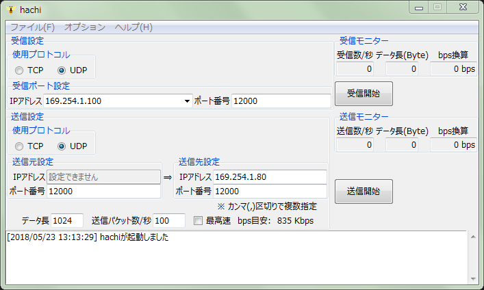

Hachi
====

ネットワークの通信負荷&スループット測定GUIツール

## Description

`Hachi`はTCP/UDPパケットによるネットワークのトラフィック負荷テストや、スループット計測に利用できます。
スループット計測する場合はクライアント側とサーバ側両方の端末で動作させてください。
類似ツール[`Nana`](https://www.vector.co.jp/soft/winnt/net/se168678.html)と互換を持たせてあるため、Nana=>Hachi、Hachi=>Nanaの組み合わせでもスループット計測は可能です。

## Demo



## VS. 

### サーバ機能

||Nana|Hachi|
|:--|:--|:--|
|TCPパケット受信|○|○|
|UDPパケット受信|○|○|
|待受IPアドレス指定|○|○|
|待受ポート指定|○|○|
|スループット計測|受信パケット数/秒<br>１パケットあたりのデータ長<br>bps|受信パケット数/秒<br>１パケットあたりのデータ長<br>bps|
|Multicast受信|○|×|
|IPv6対応|○|○|

### クライアント機能

||Nana|Hachi|
|:--|:--|:--|
|TCPパケット送信|○|○|
|UDPパケット送信|○|○|
|パケット手動生成|○|×|
|宛先IPアドレス指定|○|○|
|宛先ポート指定|○|○|
|パケットデータ長設定|○|○|
|パケット数/秒設定|○|○|
|最高速パケット送信|○|○|
|スループット計測|送信パケット数/秒<br>１パケットあたりのデータ長<br>bps|送信パケット数/秒<br>１パケットあたりのデータ長<br>bps|
|IPv6対応|○|○|

### オプション機能

||Nana|Hachi|
|:--|:--|:--|
|タスク優先度指定|○|×|
|TypeOfService設定|○|×|
|TimeToLive設定|○|×|
|送信パケットデータ長のランダム変化|○|×|
|送信パケット数/秒のランダム変化|○|×|

## Usage

## Install

適当なディレクトリに`hachi.exe`を置いて実行してください。
アンインストールは配置した`hachi.exe`を削除して下さい。

## Build

本ソフトウェアはPythonプログラムを`PyInstaller`で実行可能ファイルにパッケージングしています。

### ビルド環境

* Windows 7 64bit
* Python 3.6.4

### 依存パッケージ

* netifaces

### 実行ファイルビルドコマンド

```
pyinstaller -F -w --distpath . --icon=hachi.ico hachi.py
```

## Contribution

## Licence

[MIT](https://github.com/tcnksm/tool/blob/master/LICENCE)

## Author

[tcnksm](https://github.com/tcnksm)

